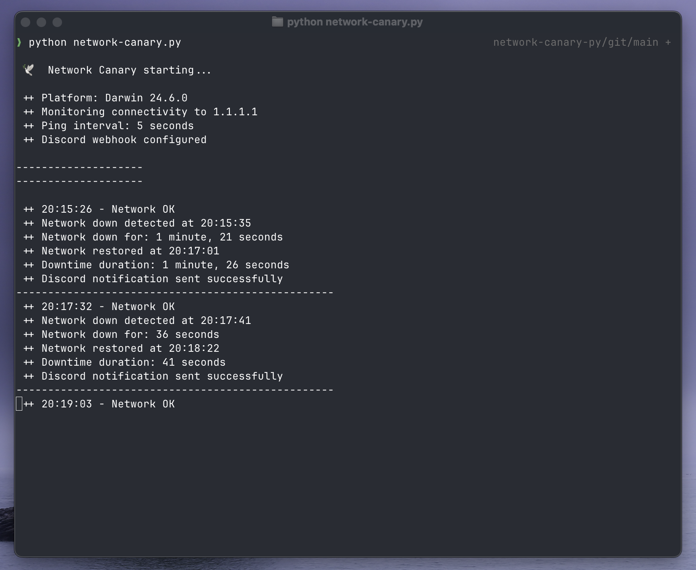
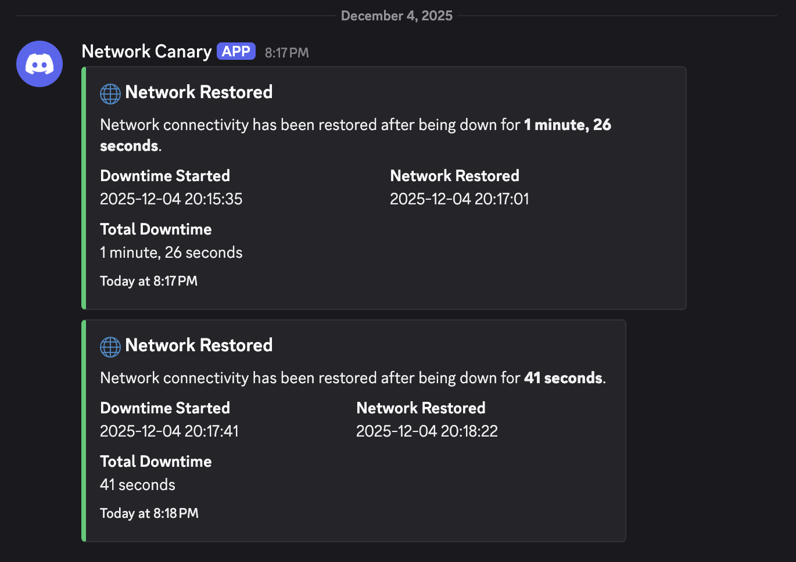

# network canary py

Python script that monitors your internet connection and reports network drops to discord. I'm running this script on a raspberry pi connected to my router via ethernet but you could run it on anything python-capable and internet-accessible.

| Script running                               | Discord receiving                              |
| -------------------------------------------- | ---------------------------------------------- |
|  |  |

## Setup

In order for the script to post to discord, it needs a webhook url. Setting up a webhook url is [very easy in discord](https://support.discord.com/hc/en-us/articles/228383668-Intro-to-Webhooks).

Once you have your webhook url copied, put it into a file, `webhook-secret`, in the same directory where the script is running. If the file isn't present, the script will skip the discord posting step and just print the info to the terminal.
